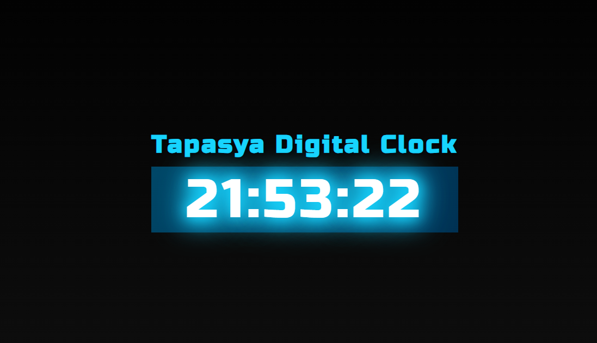

# Digital-Clock



Tapasya's Digital Clock is a simple and stylish web application that displays a digital clock with a personalized heading. The clock features a dynamic background and a subtle glow effect for added visual appeal.

## Table of Contents

- [Features](#features)
- [Getting Started](#getting-started)
- [Customization](#customization)
- [Technologies Used](#technologies-used)
- [License](#license)

## Features

- Digital clock with real-time updates.
- Stylish heading with customizable styles.
- Dynamic background and glow effect for an attractive display.

## Getting Started

1. **Clone the Repository:**
   ```bash
   git clone https://github.com/knownstranger-Tapasya/Digital-Clock.git
   cd Digital-Clock
   Open the Project:

Open the index.html file in your web browser.

Enjoy the Digital Clock:
The clock should appear along with the stylish heading.

## Customization
Feel free to customize the project to your liking. You can modify the heading text, styles, or even add more features. The style.css file contains various styling options, and the script.js file handles the clock's functionality.

## Technologies Used
HTML | CSS | JavaScript

## License
This project is licensed under the MIT License.
